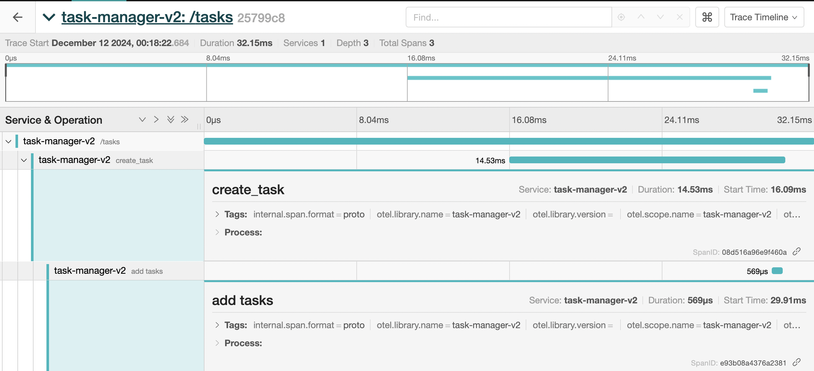

# Jaeger Integration with Flask Application


## Table of Contents
<span style="font-size: 18px;">[Jaeger Overview](#jaeger-overview)</span>

<span style="font-size: 18px;">[Why Jaeger](#why-jaeger)</span>

<span style="font-size: 18px;">[Integrate Jaeger with Flask Application](#integrate-jaeger-with-flask-application)</span>

<span style="font-size: 14px;">[Steps to Integrate](#steps-to-integrate) | </span> 
<span style="font-size: 14px;">[Install Dependencies](#install-dependencies)</span>

<span style="font-size: 18px;">[Set Up OpenTelemetry in Your Application](#set-up-opentelemetry-in-your-application)</span>

<span style="font-size: 14px;">[Instrument Flask Routes](#instrument-flask-routes) | </span> 
<span style="font-size: 14px;">[Run Jaeger and Your Application Using Docker](#run-jaeger-and-your-application-using-docker)</span>

<span style="font-size: 18px;">[Starting the Application](#starting-the-application)</span>

<span style="font-size: 14px;">[Startup.sh](#startupsh) | </span>  
<span style="font-size: 14px;">[Steps to Run](#steps-to-run)</span>

---

### Jaeger Overview

Jaeger is an open-source distributed tracing system designed to monitor and troubleshoot microservices-based applications. It helps track the flow of requests through various services and enables performance optimization by providing visibility into system latency, bottlenecks, and errors. Jaeger was initially developed by Uber Technologies and is now a part of the Cloud Native Computing Foundation (CNCF).

Jaeger collects traces from applications, which are visualized in a user-friendly interface, allowing developers to analyze and identify performance issues, understand the flow of requests, and pinpoint errors across multiple services. It supports a variety of backends and export formats, making it versatile for different use cases.

### Why Jaeger?

Jaeger is incredibly useful for several reasons:

1. **Distributed Tracing**: Jaeger provides deep insight into how requests travel through a distributed microservices architecture.
2. **Performance Monitoring**: With Jaeger, you can identify bottlenecks, slow response times, and optimize the performance of your system.
3. **Error Detection**: Jaeger helps detect errors, providing detailed logs and metadata for easier debugging.
4. **Service Dependencies**: Jaeger visualizes the relationship between services, showing which services are dependent on one another.
5. **Open-Source and Cloud Native**: Jaeger is open-source, highly extensible, and integrates seamlessly into cloud-native environments.

---

## Integrate Jaeger with Flask Application

### Steps to Integrate Jaeger with Flask

To monitor your Flask application using Jaeger, you need to integrate OpenTelemetry and Jaeger exporters to capture and visualize traces. This section walks through the steps needed to add Jaeger tracing to your Flask application.

#### Install Dependencies

Add the necessary OpenTelemetry libraries and Jaeger exporter dependencies to your [requirements file](../tasks-manager-v2/requirements.txt):

```
prometheus-flask-exporter
opentelemetry-api==1.19.0
opentelemetry-sdk==1.19.0
opentelemetry-exporter-jaeger==1.19.0
opentelemetry-instrumentation==0.41b0
opentelemetry-instrumentation-flask==0.41b0
opentelemetry-instrumentation-redis==0.41b0
opentelemetry-exporter-otlp==1.19.0
opentelemetry-instrumentation-requests==0.41b0
```
### Set Up OpenTelemetry in Your Application

Create a file similar to [opentelemetry_setup.py](../tasks-manager-v2/config/opentelemetry_setup.py) to initialize OpenTelemetry with Jaeger.

##### Instrument Flask Routes

In your main.py or wherever your routes/methods are defined, add custom spans for key methods you want to trace. 
This will give you visibility into how your app behaves and help pinpoint performance bottlenecks. An example -

```python
def example():
    # Start a custom span for this method
    with tracer.start_as_current_span("example-method-span") as span:
        span.set_attribute("custom.attribute", "value")
        
        # Simulate some work
        result = "This is a sample response"
        
        # You can add additional span attributes or events here if needed
        span.add_event("Processing request")
        
        return result
```


##### Run Jaeger and Your Application Using Docker

To run your application along with Jaeger and all necessary services (e.g., Redis, OpenTelemetry Collector), use the startup.sh script. This script will automatically start all the necessary containers and set up the network between them.

### Starting the Application

##### startup.sh

The [startup.sh](../tasks-manager-v2/startup.sh) file is used to initialize OpenTelemetry with Jaeger. Script is designed to start all required services, including Jaeger, the Flask application, Redis, and the OpenTelemetry Collector. It ensures that all services are connected on the same Docker network for communication.

###### Steps to Run:

1.	Ensure Docker is installed and running.
2. Clone this repository to your local machine.
3.	Navigate to the directory containing the startup.sh script.
4.	Run the script using the following command:

```commandline
chmod +x startup.sh
./startup.sh
```


5.	Access the Jaeger UI at http://localhost:16686 to visualize your traces and spans.
6. Send requests to your Flask application (e.g., via Postman or a browser) to generate traces.



With Jaeger integrated into your Flask application, you will now have full visibility into the performance of your services. The startup.sh script ensures that all the necessary containers (Jaeger, Redis, OpenTelemetry Collector, and your Flask app) are set up and running, allowing you to start collecting traces immediately.
