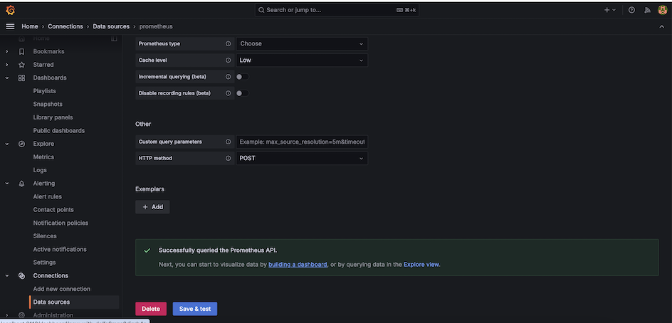
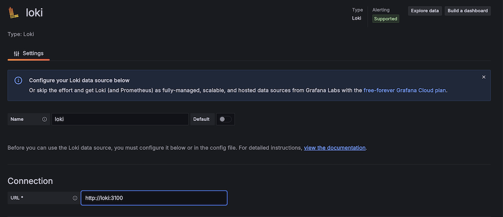
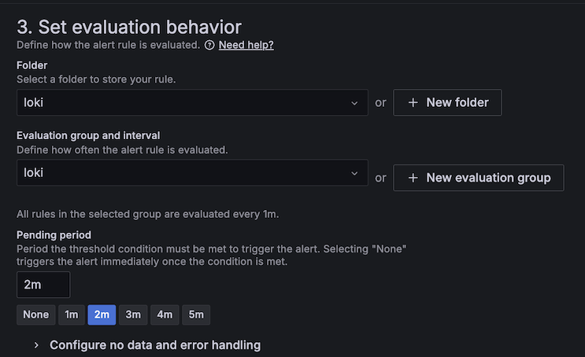

# What is Grafana?
Grafana enables you to query, visualiza, alert on and explore metrics, logs and traces from different data sources. It enables us to query and visualize:
- Time series databases like [Prometheus](./Prometheus.md) and CloudWatch
- Logging tools like [Loki](./Loki.md) and ElasticSearch
- NoSQL/SQL databases
- CI/CD tools like GitHub

Grafana provides tools to display live data on dashboard with insightful graphs and visualization.

Grafana provides a [Grafana Play](https://play.grafana.org/d/bdnahipisghdsa/getting-started-with-grafana-play?orgId=1&from=now-1h&to=now&timezone=browser), which is a sandbox for testing and learning Grafana that runs on Grafana cloud.

# Why Grafana?
- Open Source
- Data visualization
- Multiple data sources support
- Grafana Enterprise
- Metrics, logs and traces monitoring
- Alerting

# Tools Required
- Docker

# Setup Grafana
1. Build all the services  
`./build_add.sh`
2. Start the services including Prometheus, Loki, Grafana and Alertmanager  
`./startall.sh`
3. Go to [http://localhost:3110](http://localhost:3110) to access Grafana  
4. Login using **admin/admin** as username and password  
5. Skip resetting password  

# Connect to Prometheus
1. Login to [Grafana](http://localhost:3110)  
2. Go to **Connection** and select **Add new connection**  

3. Search for **Prometheus** and select it  

4. Click **Add new data source** at the top  
5. In the Connection section, set **Prometheus server url** as `http://prom:9090`  

6. Click **Save & test** and you should see below message  

## Explore Prometheus Data: Option 1
1. Go to **Data Sources**  

2. Click **Explore** for the Prometheus data source  
3. Enter a PromQL query. Sample queries could be found [here](./PrometheusQueries.md).  

## Explore Prometheus Data: Option 2
1. Go to **Explore** tab and select **Metrics**  
2. Click **New metric exploration**  

3. Select the data source (here prometheus) and look at different metrics visualization  

4. Select a metric to visualize  

5. (Optional) Open in Explore to know the query. Click the compass logo  

# Connect to Loki
1. Login to [Grafana](http://localhost:3110)  
2. Go to **Connection** and select **Add new connection** (Similar to Step 2 in [Prometheus setup](#connect-to-prometheus))  
3. Search for **Loki** and select it  

4. Click **Add new data source** at the top  
5. In the Connection section, set **Prometheus server url** as `http://loki:3100`  

6. Click **Save & test** and you should see below message  

## Explore Loki Data
1. Go to Data Sources and select **Explore** for **Loki** data source  

2. Enter a LogQL query in the code builder  
`{service_name="grocery-v1"} |= ""`  
    

3. More LogQL queries can be found [here](./LokiQueries.md)

# Visualize Dashboard
## Prometheus data source Dashboard
1. Go to Dashboard and click **Create Dashboard**  

2. Click **Add visualization**  

3. Select a data source  

4. In Query A, select data source as **prometheus** and write below query in the code builder  
`increase(http_server_requests_seconds_count{status="404"}[15m])`

5. Add a title and save dashboard  

## Loki data source Dashboard
1. Select the dashboard created [above](#prometheus-data-source-dashboard) and click **Add** to add a new visualization  
2. Select **Loki** as a data source  
3. Select visualization as **Logs** (Top right hand side, below Save Dashboard). In the query, add below LogQL  
`{level="ERROR", service_name="grocery-v2"} |= ""`  

4. Add a title and save the dashboard  

# Connect Alertmanager
1. Go to Data Sources. Click **Add data source** search for **AlertManager**  
2. Change Implementaion to **Prometheus** and enter url as `http://alertmanager:9093`  

3. Click **Save & test**  

4. Go to **Settings** in **Alerting** and enable the alertmanager. Wait for it to get enabled  
    

# Create Alerts
1. Go to **Alert Rules** (You should see Promethues alerts configured [here](../alert_rules.yml))
2. Select **New alert rule**
3. Give a name to the rule and select Loki as data source. Add below LogQL  
`count_over_time({app="grocery-v2"} [5m] |= "WARN" or "ERROR")`  

4. Select **Reduce** as the alert condition. For Input select A (which represents the above LogQL query) and keep **Function** as **Last** and **Mode** as **Strict**  

5. Create a new folder to store the rule in **Set Evaluation behavior**  

6. Create a new **Evaluation group**  

7. Select **Pending Period** as 2 minutes and then Save the alert  

8. (Optional) If the alert manager is configured on Grafana, then the alerts will be sent to the Slack channel  

