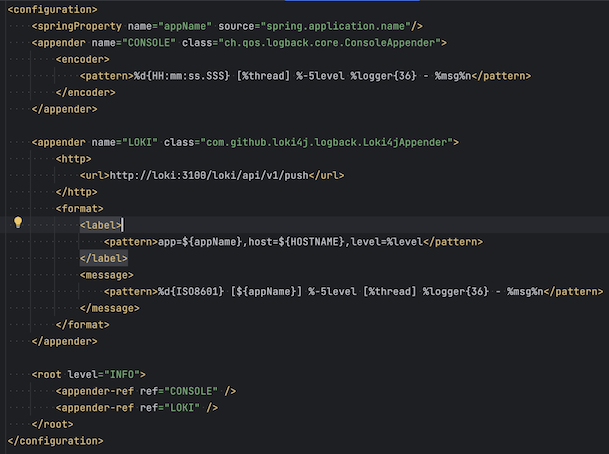
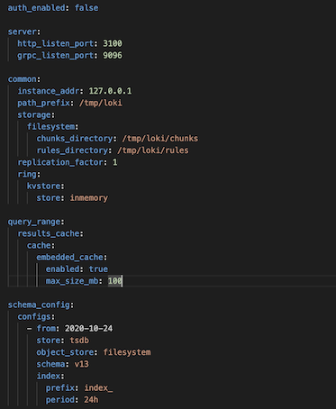
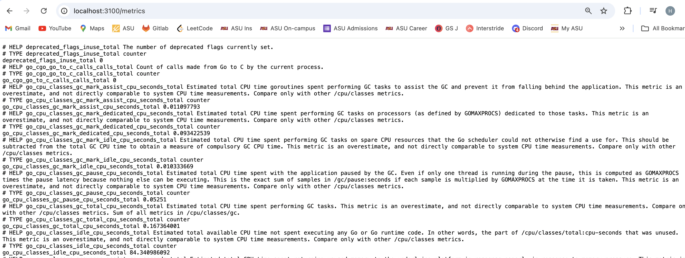

# What is Loki?
Loki is a log aggregation system designed to store and query logs from all the applications and infrastructure. The Loki project was started at Grafana Labs in 2018. It is horizontally scalable, highly available, multi-tenant log aggregation system inspired by Prometheus.

# Why Loki?
- Open Source and easy to use
- Build metrics and generate alerts
- Tail logs in the realtime
- LogQL query language to query
- Integrates with Prometheus, Grafana and K8s

# Tools Required
- Docker
- Gradle (to test locally)

# Setup to publish logs to Grafana Loki in Spring Boot
1. Add below dependency in **build.gradle**  
`implementation 'com.github.loki4j:loki-logback-appender:1.4.1'`

2. Add **logback-spring.xml** file in **resources** folder  

**NOTE**: Make sure url includes the docker container name for loki (here http://**loki**:3100)  
`<url>http://loki:3100/loki/api/v1/push</url>`

3. Create a yml config [file](../loki-config.yml) for loki  

4. Go to [http://localhost:3100/metrics](http://localhost:3100/metrics) to view log metrics  

**NOTE**: This confirms loki is setup properly. [Grafana](./Grafana.md) would be required to be able to visualize the logs and create dashboards.